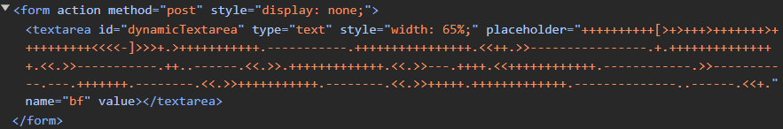

# Security Mini Project - Attacking

- [Security Mini Project - Attacking](#security-mini-project---attacking)
  - [Information Gathering](#information-gathering)
  - [Initial Access](#initial-access)
  - [Privilege Escalation](#privilege-escalation)
  - [Security Goal Violations](#security-goal-violations)
  - [Maintaining Access](#maintaining-access)

## Information Gathering

The first thing we did was to explore the website to figure out if we could find any apparent vulnerabilities.
The steps taken to do this were to create a user and try using every possible button and input field to figure out if it was possible to get access somehow.
When inputting values in the different input fields we noticed that the import note could only take one character, which we thought was a bit out of the ordinary therefore we tried playing with that a bit but to no success.
Our next steps were to use the developer tools in a browser to inspect the HTML. We did this to explore any forgotten or unwanted elements that we could
found that on the main page there was a hidden input field with some weird text as a placeholder:


We also found that if you input something in this input field and press enter you submit a form based on what is written in the input field.
We looked into the placeholder as it looked odd to us and figured out that it was written in the language `brainfuck`. And when pressing enter it open an alert that uses the following format:

```
Input:
Translated to command:
Output of command:
```

When then tried inputting the command `whoami` as `brainfuck`. (To translate whoami to `brainfuck` we used a `brainfuck` compiler on the internet) And it returned the output of command: `student`.
Which told us that we could write shell commands into this input field to get the initial access wanted.

## Initial Access

After figuring out that the input field’s translation was run on the server as a shell-command, we tried figuring out what user these commands would be run on, which was `student`. After this we tried figuring out a way for us to gain access to the server without having to translate our commands to `Brainfuck` first. For this, we generated ssh-keys and added them to `authorized_keys` so that we could ssh into the server without having to provide a password for `student`.

## Privilege Escalation

After gaining access to the server using ssh, we played around with the server looking for different files that we could access and looked at the web applications code, which did not give us much information. Therefore we instead used `sudo -l` to figure out what commands we had access to on our `student`-user, which led us to a hidden file named `exam.py` which we were able to run with root-access. `exam.py` would use an environment-variable `CMD` which would have its text shifted with a random number and then executed via `root`. So to gain access to `root` we would have to somehow have the text shifted by 0 and run a command that would open a new shell for us: `/bin/bash`. From there we just ran `exam.py` until it hit 0 and we then had a shell running with `root`-access.

## Security Goal Violations

During the information-gathering phase, we found a hidden input field that allowed execution of arbitrary commands on the server. This phase directly compromised **Confidentiality** and **Privacy**, as we accessed hidden elements not intended for user view. Additionally, the ability to run server-side commands violated **Access Control** since unauthorized commands were allowed through the input field.

By exploiting the hidden input field to execute shell commands (`whoami`) and eventually adding SSH keys to `authorized_keys`, several security goals were compromised:
- **Confidentiality**: We gained unauthorized access to sensitive information by listing users on the system.
- **Access Control**: We bypassed intended restrictions by exploiting the hidden field, which should have had proper access constraints.
- **Authentication**: Adding an SSH key without proper validation or user authentication means we bypassed security mechanisms to authenticate ourselves as a legitimate user.

After gaining initial access as the `student` user, we escalated our privileges to `root` by exploiting a vulnerability in the `exam.py` file and again several security goals were compromised:
- **Integrity**: Modifying the environment variable `CMD` to execute arbitrary shell commands compromised the integrity of the system, allowing unauthorized code execution.
- **Accountability**: By exploiting root privileges, the actions taken were not properly logged or traceable to the original `student` user, undermining the accountability of user actions.
- **Access Control**: Elevating to `root` compromised the access control policy, allowing us to perform actions restricted to super users.

To maintain access, we created a new user with superuser privileges, ensuring future unrestricted access. Thereby we violated:
- **Confidentiality**: By adding a backdoor user, we ensured that sensitive information could be continuously accessed without detection.
- **Access Control**: Creating a new superuser (`attacker`) directly violated access control policies as it circumvented standard authorization and user verification processes.
- **Non-repudiation**: By modifying `/etc/sudoers` to allow `NOPASSWD` for the `attacker` user, actions performed by this user would not be easily traceable or deniable, affecting non-repudiation.


## Maintaining Access

After we got root access we wanted to make sure that we maintained access. We did this by running the following commands:
`sudo useradd attacker`
This commands uses super user privileges to create a new user called attacker with super user access
`sudo passwd attacker`
This command creates a password for the user of attacker that only we will know
`sudo usermod -aG sudo attacker`
Which adds the user attacker to the group sudo such that attacker now have the privileges of the sudo group

After these steps we used the command
`sudo visudo`
to open /etc/sudoers where we added the following line:
`attacker ALL=(ALL:ALL) NOPASSWD: ALL`
which ensures that we can use sudo commands on the user attacker without having to write root’s password
